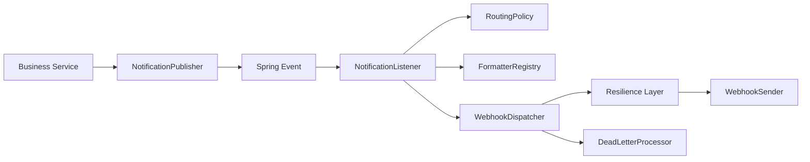

# hookrouter

Production-oriented webhook routing library for Java, with optional Spring Boot integration.

## Why this library

- Explicit routing priority: `type-mappings` -> `category-mappings` -> `default-mappings`
- Pure Java core contracts for custom runtime/transport use cases
- Spring Boot integration for configuration, dispatch pipeline, resilience, and metrics
- Resilience4j support (retry, timeout, circuit breaker, rate limiter, bulkhead)
- Dead-letter handling and reprocessing support

## Baseline

- Java: **17+**
- Spring Boot baseline: **4.0.2**
- Build: Gradle (Version Catalog + Wrapper)
- CI matrix: Java 17, 21, 25

## Modules

| Module              | Purpose                                                            |
|---------------------|--------------------------------------------------------------------|
| `hookrouter-core`   | Domain models, registries, and extension contracts                 |
| `hookrouter-spring` | Spring runtime pipeline, routing, resilience, dead-letter, metrics |

Additional sample modules are under `samples/`.

## Install

### Spring integration

Maven:

```xml
<dependency>
  <groupId>io.github.limehee</groupId>
  <artifactId>hookrouter-spring</artifactId>
  <version>${hookrouter.version}</version>
</dependency>
```

Gradle (Groovy DSL):

```groovy
implementation 'io.github.limehee:hookrouter-spring:<version>'
```

Gradle (Kotlin DSL):

```kotlin
implementation("io.github.limehee:hookrouter-spring:<version>")
```

### Core only (pure Java)

Maven:

```xml
<dependency>
  <groupId>io.github.limehee</groupId>
  <artifactId>hookrouter-core</artifactId>
  <version>${hookrouter.version}</version>
</dependency>
```

Gradle (Groovy DSL):

```groovy
implementation 'io.github.limehee:hookrouter-core:<version>'
```

Gradle (Kotlin DSL):

```kotlin
implementation("io.github.limehee:hookrouter-core:<version>")
```

## Quick Start (Spring)

```yaml
hookrouter:
  platforms:
    slack:
      endpoints:
        general:
          url: "https://hooks.slack.com/services/xxx/yyy/zzz"
  default-mappings:
    - platform: "slack"
      webhook: "general"
```

```java
Notification<OrderCreatedContext> notification = Notification
    .<OrderCreatedContext>builder("demo.order.created")
    .category("demo.order")
    .context(new OrderCreatedContext(orderId, customerName))
    .build();

notificationPublisher.publish(notification);
```

## Quick Start (Pure Java)

```java
NotificationTypeRegistry registry = new NotificationTypeRegistry();
registry.register(NotificationTypeDefinition.builder()
    .typeId("demo.event")
    .title("Demo Event")
    .defaultMessage("Demo")
    .category("general")
    .build());

Notification<String> notification = Notification.of("demo.event", "general", "payload");
```

## Architecture



## Build and Verify

```bash
./gradlew check
./scripts/verify-consumer-smoke.sh
./gradlew apiCompat -PapiBaselineVersion=<released-version>
```

## Documentation

- Index: [`docs/index.md`](docs/index.md)
- Getting started: [`docs/getting-started.md`](docs/getting-started.md)
- Spring guide: [`docs/spring-boot-guide.md`](docs/spring-boot-guide.md)
- Pure Java guide: [`docs/pure-java-guide.md`](docs/pure-java-guide.md)
- Configuration reference: [`docs/configuration-reference.md`](docs/configuration-reference.md)
- Testing/quality: [`docs/testing-and-quality.md`](docs/testing-and-quality.md)
- Release checklist: [`docs/release-checklist.md`](docs/release-checklist.md)

## Project Policies

- Contributing: [`CONTRIBUTING.md`](CONTRIBUTING.md)
- Security: [`SECURITY.md`](SECURITY.md)
- Issue templates: [`.github/ISSUE_TEMPLATE`](.github/ISSUE_TEMPLATE)
