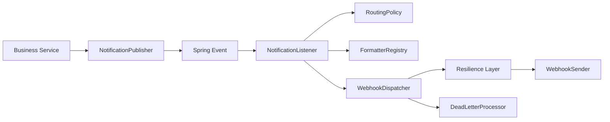

# hookrouter

`hookrouter` is a modular webhook routing and notification library for Spring Boot.

It is split into focused modules:

- `hookrouter-core`: domain model, registries, and extension contracts
- `hookrouter-spring`: Spring Boot integration, routing pipeline, resilience, dead-letter, metrics
- `samples/hookrouter-spring-mapping-sample`: Spring mapping precedence sample
- `samples/hookrouter-pure-java-sample`: pure Java routing sample
- `samples/hookrouter-adapters-slack`: sample platform adapter implementation

## Key Features

- Type-safe notifications with `Notification<T>`
- Registry-based notification type and formatter management (fail-fast on duplicates)
- Config-based routing with clear priority:
  - `typeMappings`
  - `categoryMappings`
  - `defaultMappings`
- Resilience4j integration:
  - Retry
  - Timeout
  - Circuit Breaker
  - Rate Limiter
  - Bulkhead
- Dead-letter processing and reprocessing workflow
- Micrometer metrics and Actuator health integration

## Module Docs

- Consolidated module guide: `docs/module-guides.md`

## Architecture Overview



## Quick Start (Gradle Groovy DSL)

```groovy
dependencies {
    implementation 'io.github.limehee:hookrouter-core:<version>'
    implementation 'io.github.limehee:hookrouter-spring:<version>'
}
```

Minimal configuration:

```yaml
hookrouter:
  platforms:
    slack:
      endpoints:
        general:
          url: "https://hooks.slack.com/services/xxx/yyy/zzz"

  default-mappings:
    - platform: "slack"
      webhook: "general"
```

Publish a notification:

```java
Notification<OrderCreatedContext> notification = Notification
    .<OrderCreatedContext>builder("demo.order.created")
    .category("demo.order")
    .context(new OrderCreatedContext(orderId, customerName))
    .build();

notificationPublisher.publish(notification);
```

## Build

```bash
./gradlew test
./gradlew :hookrouter-spring:integrationTest
./gradlew :hookrouter-spring:e2eTest
./gradlew check
```

## Documentation

- Index: `docs/index.md`
- Module guides: `docs/module-guides.md`
- Getting started: `docs/getting-started.md`
- Configuration reference: `docs/configuration-reference.md`
- Samples: `docs/samples.md`
- Release checklist: `docs/release-checklist.md`

## Contributing

- `CONTRIBUTING.md`
- `.github/ISSUE_TEMPLATE`
- `.github/pull_request_template.md`

## Notes About Samples

Sample modules are independent builds under `samples/` and can be tested with `./gradlew -p <sample-path> test`.
