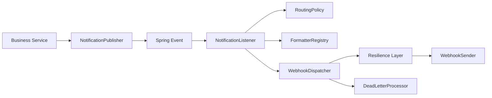

# Architecture

Separation of concerns:

- `core`: stable contracts and domain model
- `spring`: runtime pipeline and operational features
- `adapter`: platform-specific sender/formatter implementations
